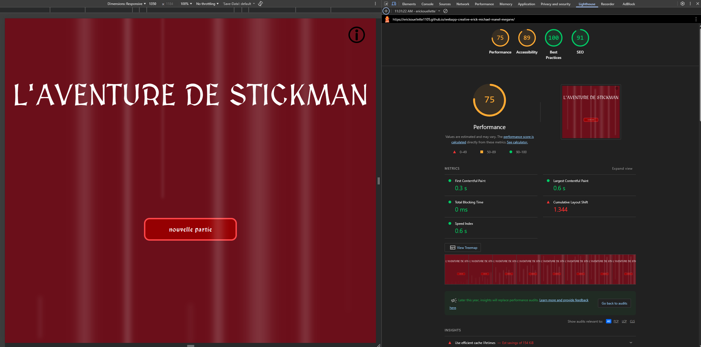
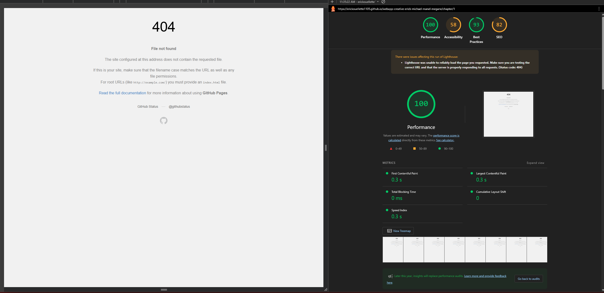
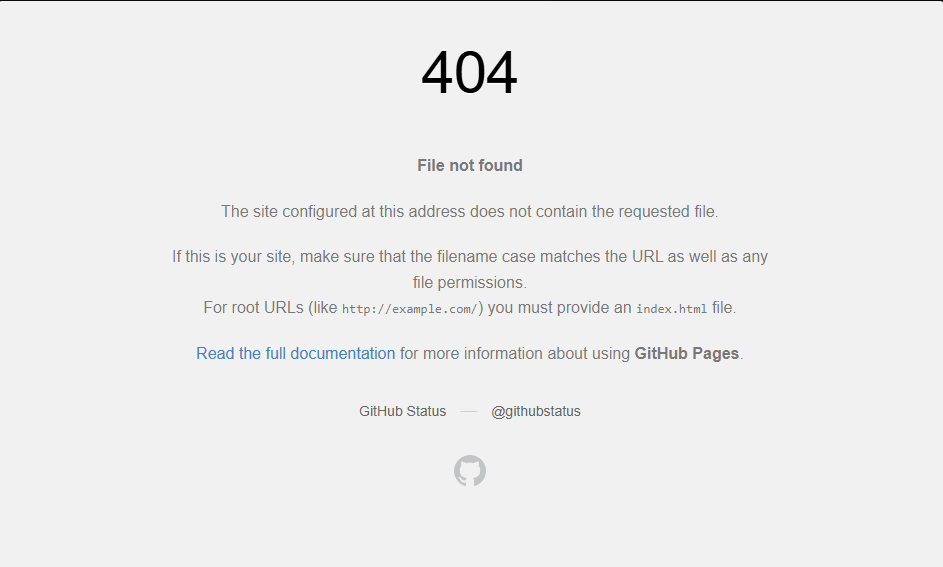

# Rapport de Contrôle Qualité

**Nom de l'équipe :** [ Michael, Érick, Manel, Mégane]  
**Nom du projet :** [L'avanture de Stickmant]  
**Type de projet :** [Trace ton chemin]  
**Date :** 8 décembre 2025

## 📋 Table des matières

1. [Informations générales](#1-informations-générales)
2. [PARTIE 1 : Tests externes](#2-partie-1-tests-externes)
3. [PARTIE 2A : Tests internes](#3-partie-2a-tests-internes)
4. [PARTIE 2B : Bogues reçus](#4-partie-2b-bugs-reçus)
5. [PARTIE 2C : Plan de corrections](#5-partie-2c-plan-de-corrections)
6. [Accessibilité](#6-accessibilité)
7. [Performance](#7-performance)
8. [Conclusion](#8-conclusion)
9. [Annexes](#9-annexes)

---

## 1. Informations générales

### Équipe

| Membre           | Rôle dans les tests               | Heures consacrées |
| ---------------- | --------------------------------- | ----------------- |
| [Michael, Érick] | Tests externes                    | [6] heures        |
| [Manel]          | Tests internes + corrections      | [5] heures        |
| [Mégane]          | Tests accessibilité + performance | [2] heures        |

**Total d'heures de QA :** [13] heures

### Liens importants

- **Projet en ligne :** [[https://erickouellette1105.github.io/webapp-creative-erick-michael-manel-megane/]]
- **GitHub :** [https://erickouellette1105.github.io/webapp-creative-erick-michael-manel-megane/]
- **Trello (bugs) :** [https://trello.com/b/wmsTghPo/projet-web-tracer-votre-chemin]
- **Projet testé (externe) :** [https://fenrir0wulf.github.io/webapp-creative-Benoit-Dana-TingYung-William/]

---

## 2. PARTIE 1 : Tests externes

### Ce que NOUS avons trouvé dans le projet de l'autre équipe

**Projet testé :** [Ox-bezoar temporel]  
**Équipe testée :** [Studio John]  
**Type :** [Trace ton chemin]

### Résumé des tests effectués

**Environnements testés :**

- ✅ Chrome 120 (Desktop/Devtools)
- ✅ Firefox 121 (Desktop/Devtools)
- ✅ Edge (Desktop/Devtools)
- ✅ Mobile 375px (Desktop/DevTools)
- ✅ Tablette 768px (Desktop/DevTools)
- ⚠️ Safari (Devtools)
- ✅ Brave (Devtools)

**Tests complétés :**

- ✅ Tests fonctionnels (checklist complète)
- ✅ Tests responsive (3 tailles)
- ✅ Tests multi-navigateurs (Chrome, Firefox)
- ✅ Tests d'accessibilité
- ✅ Tests de cas limites

### Statistiques des bugs trouvés

| Priorité     | Nombre  | %        |
| ------------ | ------- | -------- |
| 🔴 Critiques | [0]     | [0]%     |
| 🟠 Majeurs   | [4]     | [57,14]% |
| 🟡 Mineurs   | [3]     | [42,86]% |
| **TOTAL**    | **[7]** | **100%** |

### Liste des bugs trouvés (résumé)

**Tous les détails sont dans notre board Trello :** [[https://trello.com/b/9Pcw7dFa/projet-app-web-creative]]

#### 🔴 Bogues Critiques

#### 🟠 Bogues Majeurs

1. **Bogue #1 : [F5 brise la page]**]

   - **Description :** [La touche f5 fait un erreur 404]
   - **Impact :** [Cela est critique car la page peut être perdu et il faut réécrire l'url du site pour y accéder après]
   - **Statut chez eux :** [À faire]
   - **Carte Trello :** [https://trello.com/c/7ai5FmEl]

2. **Bogue #2 : [Le chapitre 16**]

   - **Description :** [Le chapitre 16 est placé avant chaque fin]
   - **Impact :** [Son placement mène à la confusion, à ce point il faudrait juste aller à la fin]
   - **Statut chez eux :** [À faire]
   - **Carte Trello :** [https://trello.com/c/fnCYuDr4]

3. \*\*Bogue #3 : [La condition d'accès pour la bonne fin]

   - **Description :** [Condition d'accès pour la bonne fin]
   - **Impact :** [L'histoire peux te donner une fin différente même si les mêmes choix sont fait ce qui est bizarre]
   - **Statut chez eux :** [À faire]
   - **Carte Trello :** [https://trello.com/c/tR7igQX8]

4. \*\*Bogue #4 : [La touche Enter/space ne marche pas]

   - **Description :** [Enter/space ne marche pas au retour à l'accueil]
   - **Impact :** [Ce bug rend la navigation au menu impossible pour les utilisateurs non-voyants]
   - **Statut chez eux :** [À faire]
   - **Carte Trello :** [https://trello.com/c/jK4Yd02N]

#### 🟡 Bogues Mineurs

5-12. [Liste brève, détails complets dans Trello]

5. \*\*Bogue #5 : [Bouton save dans mobile est non accessible]

   - **Description :** [Bouton save est caché par l'interface et on ne peut pas scroller pour interagir avec.]
   - **Impact :** [Le bouton save n'est pas accessible]
   - **Statut chez eux :** [À faire]
   - **Carte Trello :** [https://trello.com/c/yRQ9x2OI]

6. \*\*Bogue #6 : [Les images load lentement]

   - **Description :** [Les images prennent beaucoup de temps sur certain navigateurs à charger]
   - **Impact :** [Ralentit le rhytme du projet]
   - **Statut chez eux :** [À faire]
   - **Carte Trello :** [https://trello.com/c/LAY0MQdv]

7. \*\*Bogue #7 : [Pauvre ortographe au chapitre 15]

   - **Description :** [Répétition et manque de mots]
   - **Impact :** [Texte semble moins professionnel]
   - **Statut chez eux :** [À faire]
   - **Carte Trello :** [https://trello.com/c/BV4d3DEZ]

### Impression générale du projet testé

**Points forts observés :**

1. [Style visuel charmant]
2. [Histoire unique et diverse]
3. [Bonne performance malgré quelques problèmes]

**Axes d'amélioration identifiés :**

1. [Ortographe et logique de l'histoire pourrait être meilleur]
2. [Inventaire devrait être intégré]
3. [Responsive à améliorer]

**Évaluation globale (1-5 étoiles) :**

- Facilité d'utilisation : ⭐⭐⭐⭐☆
- Stabilité : ⭐⭐⭐⭐☆
- Design : ⭐⭐⭐⭐⭐
- Performance : ⭐⭐⭐⭐☆

## 3. PARTIE 2A : Tests internes

### Ce que NOUS avons testé dans NOTRE projet

### Résumé des tests effectués

**Checklist complète (à ajuster en fonction de votre projet) :**

- [✅] Navigation entre toutes les salles/chapitres
- [✅] Ajout de mémoire / Lecture des chapitres
- [✅] Édition de mémoire / Système de choix
- [✅] Suppression de mémoire / Branches narratives
- [✅] Tracking des conséquences
- [✅] Toutes les fins
- [✅] Historique des décisions
- [✅] Responsive (mobile, tablette, desktop)
- [✅] Multi-navigateurs (Chrome, Firefox)
- [✅] Navigation au clavier
- [✅] Contraste des couleurs
- [✅] Alt text sur images
- [✅] Cas limites (formulaires vides, texte long, etc.)

**Taux de réussite :** [12]/[13] tests passés = [92]%

### Environnements testés

RAS = Rien À Signaler

| Environnement   | Testé | Résultat          | Notes                               |
| --------------- | ----- | ----------------- | ----------------------------------- |
| Chrome Desktop  | ✅    | ✅ Fonctionne     | Quelques bugs mineurs               |
| Firefox Desktop | ✅    | ✅ Fonctionne     | RAS                                 |
| Edge Desktop    | ✅    | ✅                | RAS                                 |
| Mobile 375px    | ✅    | ⚠️ Bogues trouvés | [les images se mettent sur le text] |
| Tablette 768px  | ✅    | ⚠️ Bogues trouvés | [les images se mettent sur le text] |
| Desktop 1920px  | ✅    | ⚠️ Bogues trouvés | [les images se mettent sur le text] |

### Bogues trouvés dans notre propre projet

**En plus des bugs reçus de l'autre équipe, nous avons trouvé :**

| Bogue # | Titre                                                   | Priorité | Statut      | Assigné à                          |
| ------- | ------------------------------------------------------- | -------- | ----------- | ---------------------------------- |
| [1]     | [Responsive]                                            | 🔴       | En cours 🔄 | [Manel Yaya/Mégane Rangé]          |
| [2]     | [refresh des donnée au retour à l'acceuil]              | 🟡       | À faire ⏸️  | [Michael Un Dupré/Érick Ouellette] |
| [3]     | [corrigé des faute de français]                         | 🟡       | À faire ⏸️  | [tout l'équipe]                    |
| [3]     | [Alt ne marche pas sur le bouton commencer à l'accueil] | 🟡       | À faire ⏸️  | [tout l'équipe]                    |

**Total bugs trouvés en interne :** [4]

---

## 4. PARTIE 2B : Bogues reçus

### Ce que l'AUTRE équipe a trouvé dans NOTRE projet

**Équipe qui nous a testés :** Studio John
**Date de réception :** 6 décembre 2024

### Statistiques

| Priorité     | Bogues reçus | Corrigés | En cours | Pas encore faits |
| ------------ | ------------ | -------- | -------- | ---------------- |
| 🔴 Critiques | [0]          | [0] ✅   | [0] 🔄   | [0] ⏸️           |
| 🟠 Majeurs   | [1]          | [0] ✅   | [1] 🔄   | [0] ⏸️           |
| 🟡 Mineurs   | [2]          | [1] ✅   | [0] 🔄   | [1] ⏸️           |
| **TOTAL**    | **[3]**      | **[1]**  | **[1]**  | **[1]**          |

### Liste détaillée des bugs reçus

#### 🔴 Bogues Critiques reçus

#### 🟠 Bogues Majeurs reçus

**Bogue #1 : [404 au refresh de la page]**

- **Description :** [Quand le jeu est commencé (page chapitre) et que le joueur refresh il trouve une page d’erreur]
- **Étapes pour reproduire :** [Aller à une page chapitre. Refresh la page]
- **Notre analyse :** [Nous devons fixer ce problème au cas où l'utilisateur auarit ce bug]
- **Statut actuel (8 décembre) :** 🔄 En cours
- **Plan de correction :** [Le 8 décembre, nous allons chercher en ligne pour savoir comment régler ce bug.]
- **Assigné à :** [L'équipe entière]
- **Date de correction :** []

#### 🟡 Bogues Mineurs reçus

**Bogues #4-12 :** [Liste brève]
**Bogue #2 : [Fin ne fonctionne pas]**

- **Description :** [Une fin n’apparait pas même quand le joueur prend le choix “utiliser le sort mystérieux“ à chapitre 5C]
- **Étapes pour reproduire :** [Aller à chapitre 5C. Prendre le choix “utiliser le sort mystérieux“ 2 fois. Une fin ne s’exécute pas]
- **Notre analyse :** [Ceci était intentionel car le sort mystérieux]
- **Statut actuel (8 décembre) :** ✅ Corrigé
- **Plan de correction :** [Aucune correction nécessaire]
- **Assigné à :** []
- **Date de correction :** []

### Notre réaction aux bugs reçus

**Bogues que nous confirmons :**

- #1 bugs confirmés comme vrais bugs

**Bogues que nous contestons (avec justification) :**

- [Bogue #2] : Nous pensons que ce n'est pas un bug parce que [cela était prévu comme une fin qui se passe quand on remonte le temps au chapitre 1 et apr`s avoir utilisé le sort encore, la fin se déclenche]
- [A été discuté avec l'enseignant : décision finale = ...]

**Nouveaux bugs découverts grâce à leurs tests :**

- 0 bugs qu'on n'aurait jamais trouvés nous-mêmes
- Merci à l'équipe testeuse pour leur regard externe !

---

## 5. PARTIE 2C : Plan de corrections

### État au 8 décembre (aujourd'hui)

**Résumé de nos corrections :**

| Statut                              | Nombre | % du total |
| ----------------------------------- | ------ | ---------- |
| ✅ Corrigés et validés              | [0]    | [0]%       |
| 🔄 En cours (sera fait d'ici le 10) | [1]    | [33]%      |
| ⏸️ Reportés (si temps)              | [1]    | [33]%      |
| ❌ Non corrigés (justifiés)         | [1]    | [33]%      |

### Priorités de correction (8→10 décembre)

#### ✅ Déjà corrigés (avant le 8)

**Bogues critiques corrigés :**

1. aucun

#### 🔄 En cours (sera fait d'ici le 10)

**Bogues critiques en cours :**

1. **Bogue #1 : [Responsive des pages]**
   - Assigné à : [L'équipe entière]
   - Temps estimé : Maximum 3 heures
   - Sera fait : [8-9 décembre]
   - Statut actuel : [La page historique est faite, il ne reste qu'à ajuster les autres pages]

**Bogues majeurs en cours :**

2. **Bogue #2 : [404 refresh]**
   - Assigné à : [L'équipe entière]
   - Temps estimé : [Maximum 2] heures
   - Sera fait : [8-9 décembre]
   - Statut actuel : [Pas encore commencé]

#### ⏸️ Reportés (ferons si temps après les critiques/majeurs)

**Bogues mineurs à faire si temps :**

1. Bogue #Z : [Alt ne marche pas sur le bouton à l'accueil] - Temps estimé : [1]h

#### ❌ Non corrigés (avec justification)

**Bogue #2 : [Fin du sort mystérieux]**

- **Pourquoi pas corrigé :** [Ce n'est pas un bug car la fin est prévu après avoir emonté le temps au chapitre 1]
- **Impact :** [ce n'est pas un problème]

### Plan de travail (8-10 décembre)

**Lundi 8 (soir) :**

- [ ] Finir Bogue #1 (Équipe entière - 3h)
- [ ] Commencer Bogue #2 (Équipe entière - 2h)

**Mardi 9 :**

- [ ] Finir Bogue #1 (Équipe entière - 2h)
- [ ] Finir Bogue #2 (Équipe entière - 3h)
- [ ] Finir Bogue #Z (Équipe entière - 2h)
- [ ] Tests sur bugs corrigés (Équipe - 1h)
- [ ] Mise à jour documentation

**Mercredi 10 (matin avant remise) :**

- [ ] Finir Bogue #1 et 2 si pas fini
- [ ] Corrections mineures urgentes
- [ ] Tests finaux

---

## 6. Accessibilité

### Tests effectués

#### Navigation au clavier

| Test                                 | Résultat | Action                                              |
| ------------------------------------ | -------- | --------------------------------------------------- |
| Tab fonctionne sur tous les éléments | ⚠️       | ajouté des alt au objet                             |
| Focus visible                        | ✅       |
| Enter/Space activent les boutons     | ⚠️       | Marche partout sauf le bouton commencer à l'accueil |

**Problèmes trouvés :** [1]  
**Corrigés :** [2]  
**En cours :** [1]

#### Contraste des couleurs

**Tests effectués avec WebAIM Contrast Checker :**

RAS = Rien À Signaler

| Élément          | Couleurs         | Ratio   | Conforme WCAG AA | Action |
| ---------------- | ---------------- | ------- | ---------------- | ------ |
| Texte principal  | #000 sur #FFF    | 21:1    | ✅ Conforme      | RAS    |
| Boutons          | #FFF sur #960002 | 9.13:1  | ✅ Conforme      | RAS    |
| Texte secondaire | #FFF sur #333138 | 12.82:1 | ✅ Conforme      | RAS    |

**Problèmes de contraste :** [0]  
**Plan de correction :** [aucun]

#### Images et médias

| Test                               | Résultat | Notes |
| ---------------------------------- | -------- | ----- |
| Toutes les images ont un alt       | ✅       |       |
| Alt descriptifs (pas "image1.jpg") | ✅       |       |
| Images décoratives avec alt=""     | ✅       |       |

### Score global d'accessibilité

**Résumé :**

- Navigation clavier : [2] tests passés
- Contraste : [X] éléments conformes
- Images : [X] avec alt approprié

**Score estimé : [85]/100**

---

## 7. Performance

### Tests Lighthouse

**Configuration :**

- Mode : Desktop ET Mobile
- Options : Performance, Accessibility, Best Practices

#### Résultats Desktop

| Page              | Performance | Accessibility | Best Practices | Notes                                                               |
| ----------------- | ----------- | ------------- | -------------- | ------------------------------------------------------------------- |
| Accueil           | [75]/100    | [89]/100      | [100]/100      | [Commentaires]                                                      |
| [Page principale] | [100]/100   | [58]/100      | [93]/100       | [Le refresh de la page cause un 404 ce qui affect le test lighouse] |

#### Résultats Mobile

| Page              | Performance | Accessibility | Best Practices | Notes                                                               |
| ----------------- | ----------- | ------------- | -------------- | ------------------------------------------------------------------- |
| Accueil           | [74]/100    | [89]/100      | [100]/100      | [Commentaires]                                                      |
| [Page principale] | [98]/100    | [58]/100      | [86]/100       | [Le refresh de la page cause un 404 ce qui affect le test lighouse] |

**Screenshots Lighthouse :** Voir annexes

### Optimisations effectuées

#### Compression des images

| Avant        | Après                  | Économie        |
| ------------ | ---------------------- | --------------- |
| [X] MB total | [X] MB total           | [X]% économisés |
| [X] images   | [X] images compressées | Outil : TinyPNG |

**Exemples :**

- `image1.jpg` : 5.2 MB → 1.8 MB (65% économie)
- `background.png` : 3.1 MB → 800 KB (74% économie)

#### Autres optimisations

- ✅ Ajout de `loading="lazy"` sur [2] images
- ✅ Minification du code (build production)
- ✅ Suppression de console.log()

### Temps de chargement

**Tests manuels (connexion normale) :**

- Page d'accueil : [1] secondes
- Page principale : [1] secondes
- Page la plus lourde : [1] secondes

**Objectif :** < 3 secondes  
**Atteint :** ✅ Oui

---

## 8. Conclusion

### État global du projet au 8 décembre

**Le projet est-il prêt pour la remise finale ?**
⚠️ Presque, corrections en cours

**Résumé de la qualité :**

| Aspect                          | État                                     | Commentaire                                                |
| ------------------------------- | ---------------------------------------- | ---------------------------------------------------------- |
| **Fonctionnalités principales** | ✅                                       | [le jeux marche comme on le souhaite]                      |
| **Bogues critiques**            | ✅ / [à a pas de bug critique à corrigé] |
| **Bogues majeurs**              | ⚠️                                       | [2]/[2] à corrigés                                         |
| **Accessibilité**               | ⚠️                                       | Score : [54]/100                                           |
| **Performance**                 | ✅                                       | Lighthouse : [100]/100                                     |
| **Responsive**                  | ⚠️                                       | [on doit retravailler un peu sur le responisive du mobile] |

### Bilan des tests

**Statistiques globales :**

- **Bogues trouvés (tous) :** [3] (internes + reçus)
- **Bogues corrigés :** [1] ([33]%)
- **Bogues en cours :** [2] (seront corrigés d'ici le 10)
- **Bogues mineurs reportés :** [1]

**Temps total consacré au QA :** [8] heures

### Ce qui fonctionne bien ✅

1. [les fonctionnalités principales sont stables]
2. [l'inventaire marche comme prévue]
3. [la performance du site marche bien]

### Défis rencontrés et solutions 🔧

1. **Défi :** [Bogues difficiles à corrigé]

   - **Solution :** [il y à certain bug qu'on ne comprend pas comment corrigé par example la page 404 lors d'un refresh]

2. **Défi :** [Manque de temps pour tout corriger]
   - **Solution :** [il y a certain bug qui peuvent prendre plus de temps a corrigé]

### Apprentissages 📚

**Ce que nous avons appris durant le processus QA :**

1. [on doit tester sur plusieur platform]
2. [c'est utilse d'avoir une autre équipe qui aide a chercher des bug]
3. [il est important de bien documenter les bugs]

### Confiance pour la remise finale 🎯

**Sur une échelle de 1 à 10, notre confiance est : [8]/10**

**Justification :**
on est confiant(e) car on à fait nos teste necessaire et notre site est fonctionnel de là façon dont on le souhaitait, les seuls inquiétudes qui reste son la responsive et la page 404

---

## 9. Annexes

### Annexe A : Checklist complète des tests

**Grille QA**[../QA/qa3-grille-test-externe.xlsx]

### Annexe B : Screenshots Lighthouse

[Captures d'écran des rapports Lighthouse pour pages principales]

### Annexe C : Screenshots de bugs

### Annexe D : Lien vers Trello

**Board Trello avec tous les bugs :** [https://trello.com/b/wmsTghPo/projet-web-tracer-votre-chemin]

**Organisation du board :**

- Colonne "Bogues trouvés" : [2] cartes
- Colonne "En correction" : [1] cartes
- Colonne "À valider" : [0] cartes
- Colonne "Corrigé" : [1] cartes

### Annexe E : Métriques additionnelles

**Commits Git durant la phase QA :**

- [7/12/2025] : [1] commits (corrections bugs)
- [7/12/2025] : [11] commits
- Total : [12] commits de corrections

---

## ✅ Signatures

**Ce rapport a été rédigé et validé par :**

- [Érick Ouellette] - [Testeur externe/interne] - Date : [08/12/2025]
- [Michael Un Dupré] - [Testeur externe/interne] - Date : [08/12/2025]
- [Mégane Ranger] - [Testeur externe/interne] - Date : [08/12/2025]
- [Manel Yaya] - [Testeur externe/interne] - Date : [08/12/2025]

**Nous confirmons que ce rapport reflète fidèlement l'état de notre projet et de notre processus QA.**

---

**Date de dernière mise à jour :** 8 décembre 2025
