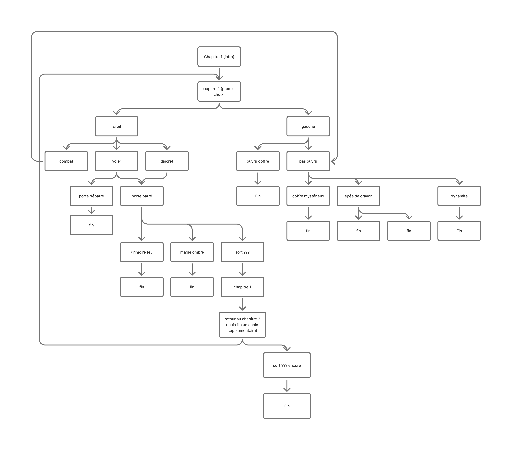

# Cahier de Charges: Trace ton chemin

## 📌 Informations du Projet

*Nom du projet:* L'aventure de Stickamn 

*Nom de l'équipe:* Paladin

*Membres:* Érick Ouellette, Michaël Un Dupré, Manel Yaya, Mégane Ranger

- Érick Ouellette - Chef de projet + Architecture
- Michaël Un Dupré - Données + Systèmes
- Mégane Ranger - Responsable du Design + Animations
- Manel Yaya


*Date de début:* [8 octobre 2025]  
*Date de livraison finale:* [10 décembre 2025]  
*Version du document:* 1.0


## 🎯 1. Présentation du Projet

### 1.1 Concept général

L'aventure de Stickman est une histoire interactive fantastique où le joueur incarne John Stickman, un homme pitoyable qui doit sauver son frère des griffes du méchant nécromancien pour stopper son plan diabolique. Stickman va devoir prendre son courage à deux mains et pénétrer le dongeon de l'impitoyable Velkram. 

Le joueur doit faire des choix de tactiques durant des combats et résoudre des énigmes qui vont influencer le progrès de Stickman que ce soit vers sa montée à la gloire où sa descente au purgatoire.  

- fantaisie/comédie/drame
- aller vaincre Velcram
- John Stickman
- Inventaire avec objet qui débloque des choix


### 1.2 Public cible

- *Âge: 8-25 ans
- *Profil:* fans de fantaisie/D&D
- *Niveau technique:* Utilisateurs grand public
- *Temps de lecture estimé:* 5-12 minutes

### 1.3 Objectifs du projet

- [ ] Créer une expérience narrative immersive et émotionnelle
- [ ] Développer un système de choix avec conséquences réelles
- [ ] Implémenter un système d'inventaire
- [ ] Démontrer la maîtrise de Vue.js, GSAP et Pinia
- [ ] Créer une interface accessible et responsive


## 📖 2. Architecture Narrative

### 2.1 Synopsis détaillé

Jean-pierre Stickman se rend au dongeon du maléfique Velkar. John Stickman doit le vaincre pour pouvoir libéré son frère qui à été kidnapper. Il fait face à des multitudes de monstres qu'il doit battre pour progresser et débloquer des objets magique pour devenir assez puissant pour sauver son frère.

### 2.2 Arbre narratif

Dessinez ou décrivez l'arbre de décisions de votre histoire:



```

### 2.3 Liste des chapitres/scènes

Minimum 8 niveaux (chapitres/scènes). Listez-les avec leurs informations:

<small>(les noms des chapitres énoncés ici ne sont que des exemples)</small>

| # | Nom du chapitre | Type | Description courte | Choix proposés | Conséquences |
|---|----------------|------|-------------------|----------------|--------------|
| 1 | [L'arrivée] | Linéaire | Introduction du personnage et du contexte | Aucun (intro) | N/A |
| 2 | [le premier pas] | Choix | arriver devant un intersection dans le dongeon | 2 choix: "aller à droite" ou "aller à gauche" | Branche A ou B |
| 3A | [rarw goblin] | Choix | des goblin dort dans la pièce| choix 1: passer les goblin choix 2: voler des goblins choix 3: chargé! | Branche A ou B ou C |
| 3B | [Le coffre] | Choix | un coffre se retrouve dans cette pièce | choix 1: passer a l'autre pièce choix 2: ouvrir le coffre | Branche C ou D |
| 4A | [La surprise]| Linéaire | tu te fait téléporter dans une autre chambre| Aucun | t'arrive dans le chapitre 5A|
| 4B | [Chasse au Goblin]| Linéaire | tu combat les goblin après avoir voler leur butin | auncun | t'arrive en retard pour sauvé jean-Pierre acces à une fin spécial|
| 4C | [L'apprentis mage]| Linéaire | tu te retrouve dans une pièce avec des sort magique| choix du sort | tu peut apprendre une sort pour aider à combattre le necromance|
| 5A | [L'apprentis combatant]| choix |tu te retrouvent dans une pièce avec des armes  | choix d'arme/armure| tu prend des arme pour aider dans le combat contre le nécromance|
| 5B | [le combat]| linéaire |tu combat le nécromance mais tu est trop tard pour sauvé Jean-Pierre  | Jean-pierre n'est pas sauvé donc il y aurra un autre méchant a combattre| fin anti Héroique|
| 5C | [le combat]| linéaire| tu combat le nécromance| aucun| fin héroique qui dépend des objets|
| 5D | [le zéro]| linéaire| ta perdu | aucun | perdu|

### 2.4 Fins possibles

Listez toutes les fins de votre histoire (minimum 3, idéal 4-6):

<small>(les noms des fins énoncées ici ne sont que des exemples)</small>

| # | Nom de la fin | Condition pour l'atteindre | Type (bonne/mauvaise/neutre) |
|---|--------------|---------------------------|------------------------------|
| 1 | fin plume du phoenix | aquérir le grimoire de feux | Bonne |
| 2 | fin mage des ombres | aquérir la magie des ombre | Bonne |
| 3 | Fin du visionneur passifique | aquérir le sort ??? et l'utiliser deux fois de suite | Neutre|
| 4 | Bonne fin | aquérir l’épée suprême du maître goblin | Bonne |
| 5 | fin du bouffon |aquérir l'épée crayon et l'armure papier  | mauvaise |
| 6 | fin Boom | aquérir la dynamite | Neutre |
| 7 | Mauvaise fin | utiliser l'attaque de bras de stickman | Mauvaise |
| 8 | Ouch! | se faire manger par une mimique | mauvaise |

### 2.5 Personnages principaux

| Nom | Rôle | Description | Apparaît dans |
|-----|------|-------------|---------------|
| [John Stickman] | Protagoniste | Guerrier pathétique | Tous les chapitres |
| [Velkram] | Antagoniste | Sorcier maléfique | Certaines fins |
| | | | |
| | | | |

### 2.6 Système de conséquences

Comment les choix influencent l'histoire?

*Mécanisme choisi:*

- [ ] *Système de karma/moralité* (points bons/mauvais)
- [ ] *Stats du personnage* (courage, intelligence, empathie)
- [x] *Inventaire d'objets* (collecte d'items)
- [ ] *Relations avec personnages* (affinités)
- [ ] *Flags de choix* (choix X débloque scène Y)
- [ ] *Combinaison de plusieurs systèmes*

*Exemple de tracking:*
```javascript
playerState: {
  karma: 0,  // -10 à +10
  inventory: ['clé', 'journal'],
  relationships: {
    marcus: 5,  // 0 à 10
    chronos: -3
  },
  flags: {
    hasActivatedMachine: true,
    knowsTheSecret: false
  }
}
```


## 🎨 3. Design et Identité Visuelle

### 3.1 Moodboard

- Image 1: Ambiance générale: 
<br>


- Image 2: Style visuel des personnages: 
<br>


- [Image 3: Palette de couleurs](https://coolors.co/087e8b-eb5e28-cdcacc-333138-6e0d25)
<br>

- [Image 4: Typographie inspirante](https://fonts.google.com/specimen/MedievalSharp)

### 3.2 Palette de couleurs

*Couleurs par ambiance/chapitre:*

- *Chapitres introduction:* [#CDCACC] - Tons neutres
- *Chapitres tension:* [#333138] - Tons sombres/dramatiques
- *Chapitres espoir:* [#087e8b] - Tons clairs/lumineux
- *Chapitres danger:* [#eb5e28] - Rouge/orange

*Couleurs système:*

- Primaire (actions principales): [#6E0D25]
- Secondaire (choix): [#333138] [#EB5E28]
- Succès: [#087e8b]
- Danger: [#EB5E28]
- Neutre: [#CDCACC]

### 3.3 Typographie

- *Titres narratifs:* [MedievalSharp](https://fonts.google.com/specimen/MedievalSharp)
- *Texte de narration:* [Baldur](https://www.1001freefonts.com/fr/baldur.font)
- *Dialogues:* [Golden Swing](https://www.1001freefonts.com/fr/golden-swing.font)
- *Boutons de choix:* [Darker](https://www.1001freefonts.com/fr/darker-font.font)

### 3.4 Style visuel

Choisissez un ou plusieurs styles:

- [ ] Cinématique (film noir, thriller)
- [x] Illustratif (dessins, concept art)
- [x] Minimaliste (focus sur le texte)
- [ ] Immersif (photos, ambiances réalistes)
- [ ] Stylisé (flat design, géométrique)

### 3.5 Éléments visuels par chapitre

| Chapitre | Image de fond | Effets visuels |
|----------|---------------|----------------|
| 1 | le personnage avec du texte  |
| 2 | le personnage avec du texte  |
| 3A | le personnage avec du texte  |
| 3B | le personnage avec du texte  |
| 4A | le personnage avec du texte  |
| 4B | le personnage avec du texte  |
| 4C | le personnage avec du texte  |
| 4D | le personnage avec du texte |
| 5A | le personnage avec du texte  |
| 5B | le personnage avec du texte  |
| 5C | le personnage avec du texte  |
| 5D | [tu est mort] | le personnage avec du texte  |
| fin (mauvaise) | le personnage avec du texte |
| fin (bonne) | le personnage avec du texte  |


## 💻 4. Spécifications Techniques

### 4.1 Stack technologique

*Frontend obligatoire:*

- ✅ Vue.js 3 (Composition API ☐ / Options API ☐)
- ✅ Vite
- ✅ Vue Router
- ✅ Pinia (state management)
- ✅ CSS
- ✅ GSAP + ScrollTrigger (optionnel selon style)

*Librairies additionnelles envisagées:*

- [ ] VueUse (composables utilitaires)

### 4.2 Architecture des composants

Listez vos composants Vue principaux:

*Composants de layout:*

- `AppHeader.vue` - Navigation et menu

*Composants de contenu:*

- `ChapterView.vue` - Vue d'un chapitre/scène
- `NarrativeText.vue` - Affichage du texte narratif
- `DialogueBox.vue` - Boîte de dialogue pour personnages
- `ChoiceButton.vue` - Bouton de choix interactif
- `ChoicePanel.vue` - Panel contenant tous les choix

*Composants système:*

- `AppHeaderGame.vue` - Affichage de l'inventaire
- `AppCredit.vue` - Affiche des Crédit
- `Modal.vue` - Fenêtre modale (sauvegarde, options)

*Composants UI:*

- `ButtonPrimary.vue` - Bouton principal
- `LoadingSpinner.vue` - Indicateur de chargement
- `AudioController.vue` - Contrôle de la musique/sons

### 4.3 Routes (Vue Router)

| Route | Composant | Description | Params |
|-------|-----------|-------------|--------|
| `/` | `HomeView.vue` | Menu principal | - |
| `/chapitre/:id` | `ChapterView.vue` | Vue d'un chapitre | id du chapitre |
| `/fin/:endingId` | `EndingView.vue` | Écran de fin | id de la fin |
| `/credits` | `CreditsView.vue` | Crédits | - |

### 4.4 Gestion de l'état (Pinia)

*Stores prévus:*

1. *`useStoryStore`*
   - State: `currentChapterId`, `visitedChapters`, `storyData`, `availableChoices`
   - Actions: `loadChapter()`, `makeChoice()`, `goToChapter()`
   - Getters: `currentChapter`, `isChapterUnlocked()`

2. *`usePlayerStore`*
   - State: `playerName`, `karma`, `stats`, `inventory`, `flags`, `relationships`
   - Actions: `addToInventory()`, `updateStat()`, `setFlag()`, `updateRelationship()`
   - Getters: `hasItem()`, `getRelationship()`, `canAccessEnding()`

3. *`useSaveStore`*
   - State: `saveSlots` (array de 3 slots)
   - Actions: `saveGame()`, `loadGame()`, `deleteSave()`, `getSaveInfo()`
   - Getters: `hasSaves`, `latestSave`

4. *`useAudioStore`* (optionnel)
   - State: `currentMusic`, `soundEffects`, `volume`, `isMuted`
   - Actions: `playMusic()`, `playSound()`, `toggleMute()`, `setVolume()`

### 4.5 Persistance des données

*Méthode choisie:*

- [x] LocalStorage (obligatoire pour sauvegardes)
- [ ] Firebase Firestore (bonus optionnel pour galerie publique)

*Structure de données LocalStorage:*

```json
{
  "saveSlot1": {
    "savedAt": "2025-01-15T14:30:00Z",
    "playerName": "Alex",
    "currentChapterId": "chapter-5",
    "playerState": {
      "karma": 5,
      "stats": {
        "courage": 7,
        "intelligence": 8,
        "empathy": 6
      },
      "inventory": ["clé", "journal", "photo"],
      "flags": {
        "hasActivatedMachine": true,
        "knowsTheSecret": true,
        "savedMarcus": false
      },
      "relationships": {
        "marcus": 8,
        "chronos": -5
      }
    },
    "visitedChapters": ["ch-1", "ch-2", "ch-3a", "ch-4", "ch-5"],
    "choiceHistory": [
      { "chapterId": "ch-2", "choiceId": "activate", "timestamp": "..." },
      { "chapterId": "ch-3a", "choiceId": "go-past", "timestamp": "..." }
    ]
  },
  "saveSlot2": null,
  "saveSlot3": null,
  "settings": {
    "volume": 0.7,
    "textSpeed": "normal",
    "autoSave": true
  }
}
```

### 4.6 Structure de données de l'histoire

Comment stockez-vous les chapitres et choix?

*Option A: JSON statique* (recommandé)
```javascript
// data/chapters.json
{
  "ch-1": {
    "id": "ch-1",
    "title": "L'arrivé",
    "text": "Vous êtes arrivée devant l'entrer du dongeon...",
    "backgroundImage": "/",
    "choices": null,  // Chapitre linéaire
    "nextChapter": "ch-2"
  },
  "ch-2": {
    "id": "ch-2",
    "title": "le premier pas",
    "text": "Face à un intersection le choix est le votre",
    "backgroundImage": "/",
    "choices": [
      {
        "id": "doite",
        "text": "aller a droite",
        "consequence": "vous partez vers la droite",
        "nextChapter": "ch-3a",
        "effects": {
          "vie": 10,
          "monnaie": 100 ,
        }
      },
      {
        "id": "gauche",
        "text": "aller a gauche",
        "consequence": "vous partez vers la gauche",
        "nextChapter": "ch-3b",
        "effects": {
          "vie": 10,
          "monnaie": 100 ,
        }
      }
    ]
  }
}
```


## 🎬 5. Fonctionnalités et User Stories

### 5.1 Fonctionnalités MVP (Minimum Viable Product)

*Obligatoires pour la livraison:*

- [X] *F1 - Lecture de l'histoire*
  - Affichage du texte narratif chapitre par chapitre
  - Navigation linéaire dans l'intro
  - Transitions fluides entre chapitres

- [X] *F2 - Système de choix*
  - Affichage de 2-4 choix par chapitre décisionnel
  - Sélection d'un choix
  - Redirection vers le chapitre suivant approprié
  - Minimum 8 chapitres avec au moins 3 fins

- [X] *F3 - Tracking des conséquences*
  - État du joueur (karma/stats/flags)
  - Mise à jour après chaque choix
  - Conditions pour débloquer fins

- [ ] *F4 - Système de sauvegarde*
  - 3 slots de sauvegarde
  - Sauvegarde manuelle
  - Chargement d'une sauvegarde
  - Affichage des infos de sauvegarde (date, progression)

- [X] *F5 - Historique des choix*
  - Garder trace des décisions prises
  - Affichage dans un menu (optionnel mais recommandé)

- [X] *F6 - Écrans de fin*
  - Affichage de la fin atteinte
  - Récapitulatif des choix faits
  - Option de recommencer ou charger

- [ ] *F7 - Interface responsive*
  - Mobile (320px+)
  - Tablette (768px+)
  - Desktop (1024px+)

- [ ] *F8 - Animations de texte*
  - Apparition progressive du texte (optionnel: effet typewriter)
  - Transitions entre chapitres avec GSAP

- [X] *F9 - Accessibilité*
  - Navigation au clavier
  - ARIA labels
  - Contraste WCAG AA
  - Option skip animations

- [X] *F10 - Médias intégrés*
  - Images de fond par chapitre
  - Musique d'ambiance (avec contrôle volume)

### 5.2 Fonctionnalités bonus (optionnelles)

- [ ] *B1 - Auto-save*
  - Sauvegarde automatique à chaque chapitre
  - Indication visuelle de la sauvegarde

- [X] *B2 - Inventaire visuel*
  - Affichage graphique des items
  - Description des objets au survol

- [ ] *B3 - Stats visuelles*
  - Barres de progression pour stats
  - Graphique radar des caractéristiques

- [ ] *B4 - Arbre de choix visualisé*
  - Carte interactive des chemins possibles
  - Indication des chapitres visités/non-visités

- [ ] *B5 - Galerie des fins*
  - Collection de toutes les fins débloquées
  - Pourcentage de complétion

- [ ] *B6 - Mode rejouabilité*
  - Fast-forward pour texte déjà lu
  - Skip to choice (sauter au prochain choix)

- [ ] *B7 - Effets sonores contextuels*
  - Sons lors de choix importants
  - Ambiances sonores par scène

- [ ] *B8 - Animations avancées GSAP*
  - Parallax sur les backgrounds
  - Animations de transition complexes

- [ ] *B9 - Firebase (équipes avancées)*
  - Partage de fins débloquées
  - Galerie publique d'histoires

### 5.3 User Stories

*Format:* En tant que [rôle], je veux [action] afin de [bénéfice]

1. *US-01:* En tant que lecteur, je veux lire une histoire interactive afin de vivre une expérience narrative immersive.

2. *US-02:* En tant que joueur, je veux faire des choix qui ont des conséquences afin de sentir que mes décisions comptent.

3. *US-04:* En tant que lecteur, je veux voir l'impact de mes choix afin de comprendre comment ils influencent l'histoire.

4. *US-05:* En tant que joueur, je veux atteindre différentes fins afin de découvrir toutes les possibilités de l'histoire.

5. *US-06:* En tant qu'utilisateur mobile, je veux lire l'histoire sur mon téléphone afin d'en profiter partout.

6. *US-07:* En tant que lecteur, je veux consulter l'historique de mes choix afin de me rappeler mes décisions passées.

7. *US-08:* En tant que joueur, je veux collecter des objets/débloquer afin de me sentir progresser dans l'aventure.


## 📊 6. Maquettes et Wireframes

### 6.1 Lien vers les maquettes Figma

*Lien:* [Maquette](https://www.figma.com/design/LR4IXllpioUzEXahY2muVH/Untitled?node-id=0-1&t=HMYAG9Dytk87QrCf-1)

### 6.2 Écrans principaux à maquetter

- [x] Menu principal (nouvelle partie, charger, options)
- [x] Écran de chapitre avec texte narratif
- [ ] Panel de choix (2-4 options)
- [x] Inventaire/Stats (si applicable)
- [x] Écran de fin avec récapitulatif
- [x] Gestion des sauvegardes (3 slots)
- [ ] Version mobile d'au moins 2-3 écrans

### 6.3 Interactions clés à maquetter

- Apparition progressive du texte
- Animations des boutons de choix
- Ouverture de l'inventaire/stats
- États des boutons (hover, actif, disabled)


## 📊 7. Plan de Réalisation

### 7.1 Répartition des rôles

| Membre | Rôle principal | Responsabilités |
|--------|----------------|-----------------|
| [Érick Ouellette] | Chef de projet + Architecture Vue | Coordination, Vue Router, stores Pinia, structure de l'histoire |
| [Mégane Rangé] | Design + Animations | CSS, design visuel, animations GSAP, transitions |
| [Manel Yaya] | Contenu + Narration | Écriture des chapitres, création de l'arbre narratif, dialogues |
| [Michaël Un Dupré] | Données + Système | Gestion des sauvegardes, LocalStorage, logique de choix, stats |

*Note:* Tous participent au développement, mais chacun a sa spécialité.

### 7.2 Tâches transversales

*À répartir entre tous:*

- Tests de l'histoire (lecture complète)
- Correction de fautes et relecture
- Tests et debugging
- Documentation du code
- Présentation finale

### 7.3 Outils de collaboration

- *Git/GitHub:* [repo](https://github.com/erickouellette1105/webapp-creative-erick-michael-manel-megane/tree/Fix-accueil)
- *Gestion de projet:* [Trello](https://trello.com/b/wmsTghPo/projet-web-tracer-votre-chemin)
- *Communication:* [Teams]
- *Design:* [Figma]
- *Documentation:* [README.md]
- *Écriture collaborative:* [README.md]


## 🚀 8. Critères de Succès

### 8.1 Critères techniques

- [X] Application Vue.js fonctionnelle sans erreurs console
- [X] Minimum 8 composants Vue bien structurés
- [X] Vue Router avec 5+ routes
- [X] Pinia implémenté avec state management cohérent
- [X] CSS organisé avec variables
- [ ] Animations GSAP fluides
- [ ] Code validé (ESLint)
- [ ] Responsive sur 3 breakpoints
- [ ] Accessibilité WCAG AA

### 8.2 Critères narratifs

- [X] Histoire cohérente du début à la fin
- [X] Minimum 8 chapitres/scènes
- [X] Au moins 3 fins différentes
- [X] Choix ayant un impact réel sur l'histoire
- [ ] Aucune faute d'orthographe majeure
- [X] Dialogues naturels et crédibles
- [X] Rythme narratif bien dosé

### 8.3 Critères de qualité

- [X] Interface intuitive et facile à utiliser
- [X] Design cohérent et esthétique
- [X] Lisibilité du texte (taille, contraste, police)
- [ ] Animations pertinentes (pas excessives)
- [X] Temps de chargement < 2 secondes
- [X] Aucun bug bloquant
- [X] Documentation complète (README)

### 8.4 Critères créatifs

- [X] Histoire originale et engageante
- [X] Personnages mémorables
- [X] Twist ou surprise dans l'intrigue
- [X] Expérience émotionnelle impactante
- [X] Rejouabilité (envie de tester d'autres chemins)


## 📅 9. Calendrier du projet: Planning prévisionnel

### 9.1 *PHASE 1: PLANIFICATION ET DESIGN*
<!--Semaine 1-2 (la 2 étant la semaine de rattrapage)-->

**Du 8 au 22 octobre**

*Remise 22 octobre | 15%*

- Rédaction du cahier de charges
- Écriture de l'arbre narratif complet
- Design: Création des maquettes Figma
- Définition de l'architecture technique
- Setup du projet (Vite + Vue + dépendances)

### 9.2 *PHASE 2: FONDATION*
<!--Semaine 3-4-->

**Du 22 octobre au 2 novembre environ**

*Remise Phases 2 FONDATION et 3 INTERACTIVITÉ : vendredi 14 novembre | 15%*

- Structure des composants de base
- Vue Router configuré
- Pinia stores créés
- Premiers chapitres (texte + affichage)

### 9.3 *PHASE 3: INTERACTIVITÉ - Système de Choix*
<!-- Semaine 4-5-->

**Environ du 2 novembre au 12 novembre**

*Remise Phases 2 FONDATION et 3 INTERACTIVITÉ : vendredi 14 novembre | 15%*

- Logique de branches narratives
- Système de tracking des conséquences
- Composants de choix interactifs
- Plus de chapitres écrits et intégrés


### 9.4 *PHASE 4: ANIMATIONS ET MÉDIAS*
<!-- Semaine 6 -->

**Du 12 au 19 novembre**

*Remise Phases 4 ANIMATIONS+MÉDIAS et 5 PERSISTANCE : 26 novembre | Formatif*

- Intégration GSAP (transitions)
- Images de fond par chapitre
- Musiques/sons d'ambiance
- Animations de texte


### 9.x *ÉVALUATION PAR LES PAIRS ET AUTO-ÉVALUATION DE MI PARCOURS*

**Sera fait en classe le 19 novembre**

*Remise de l'évaluation par les pairs et auto-évaluation de mi parcours: 19 novembre | 5%*


### 9.5 *PHASE 5: PERSISTANCE ET SAUVEGARDE DES DONNÉES + Fin de l'histoire*
<!-- Semaine 7 -->

**Du 19 au 26 novembre**

*Remise Phases 4 ANIMATIONS+MÉDIAS et 5 PERSISTANCE : 26 novembre | Formatif*

- Système de sauvegarde (3 slots)
- LocalStorage complet
- Toutes les fins écrites et intégrées
- Écrans de fin avec récapitulatif

### 9.6 *PHASE 6: AFFINAGE ET ACCESSIBLITÉ* pour la version *BETA*

**Du 26 novembre au 3 décembre**

*Remise version *BETA* le 3 décembre | Formatif*

- Responsive final
- Accessibilité (ARIA, keyboard)

### 9.7 *PHASE 7:  CONTRÔLE QUALITÉ ET CORRECTIONS*
<!-- Semaine 8 -->
**Du 3 au 8 décembre**

*Remise Phase 7 RAPPORT DU CONTRÔLE DE LA QUALITÉ : 8 décembre | 10%*

- Tests de toutes les branches de l'histoire
- Tests fonctionnels
- Tests multi-plateformes (navigateurs et appareils)
- Relecture et corrections
- Optimisation de la performance
- Gestion des bogues

### 9.8 *PHASE 8:  FINALISATION*
<!-- Semaine 8 + 2 jours-->

**Du 3 au 10 décembre** (peut-être fait en parallèle avec la phase 7)

*Remise et présentation finale : 10 décembre | 50%*

- Documentation (README complet)
- Déploiement - Mise en ligne (GitHub/Netlify/Vercel)
- Vidéo de présentation
- Préparation de la démo en classe

### 9.9 *PHASE 9: POST-MORTEM*

**Du 10 au 12 décembre**

*Remise de l'analyse réflexive et suivi de l'évaluation de mi-parcours: 12 décembre | 5%*


## 🎯 10. Risques et Solutions

| Risque | Probabilité | Impact | Solution préventive |
|--------|-------------|--------|---------------------|
| Scope creep narratif (trop d'histoire) | Élevée | Élevé | Limiter à 8-10 chapitres max, garder histoires simples |
| Manque de temps pour écrire | Élevée | Élevé | Écrire les chapitres AVANT de coder, paralléliser |
| Bugs dans la logique de branches | Moyenne | Élevé | Tester chaque branche manuellement, diagramme clair |
| Incohérences narratives | Moyenne | Moyen | Relecture croisée, document de tracking des flags |
| Fautes d'orthographe | Élevée | Faible | Utiliser correcteur, relecture collective |
| Sauvegardes corrompues | Faible | Élevé | Validation JSON, gestion d'erreurs, tests intensifs |


## 📝 11. Annexes

### 11.1 Ressources et références

*Documentation officielle:*

- Contenu du cours Web 5 https://tim-montmorency.com/compendium/582-511-web5/
- Guide étudiant du projet appli web créative: https://tim-montmorency.com/compendium/582-511-web5/projets/appweb-creative/syllabus_guide_etudiant.html
- Vue.js: https://vuejs.org
- Pinia: https://pinia.vuejs.org
- GSAP: https://greensock.com/docs/

*Inspiration narrative:*

- Dongeon et dragon
- Henry stickman

*Tutoriels utiles:*

- [code pour monnaie](https://youtu.be/BTQgFlbq5HU)
- [code pour system de vie](https://youtu.be/Wh2kVSPi_sE)

### 11.2 Glossaire

- *Branche:* Chemin narratif distinct selon les choix
- *Flag:* Variable booléenne qui track un événement
- *Ending:* Fin possible de l'histoire
- *argent:* Système de monnaie
- *Node:* Point de décision dans l'arbre narratif
- *Save slot:* Emplacement de sauvegarde


## ✅ Validation du Cahier de Charges

*Date de validation:* [Date]

*Signatures:*

- Chef de projet: Érick Ouellette
- Membre 2: Michael Un Dupré
- Membre 3: Mégane Rangé
- Membre 4: Manel Yaya

*Validation enseignant:* _______________  
*Date:* _______________  
*Commentaires:*

---

*Version du document cahier de charge:* 2.0  
*Dernière mise à jour:* 12/7/2025
